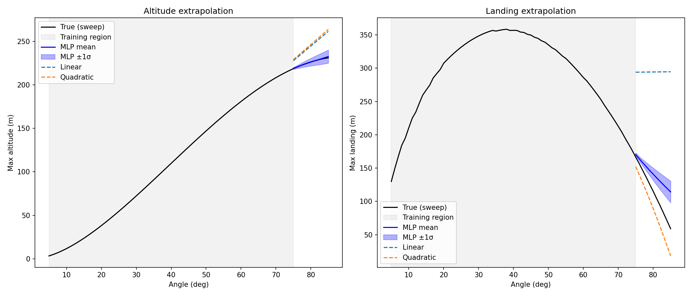

## Rocket Trajectory Model with Neural Network

**Research Question: "Can an MLP extrapolate to launch angles beyond its training range?"**

### TL;DR 
On altitude (a mild curve over 75-85°) the MLP extrapolates way better than the linear or quadratic baselines.
On landing (a quickly bending curve) the MLP lost to the quadratic baseline by quite a bit.
Ultimately, the MLP extrapolates far better than any baseline on altitude but could not compete
against a simple quadratic fit for predicting landing.

### Method
Created a physics engine that simulates trajectories using a 4th-order Runge-Kutta method, sweeping angles from 5-85˚ for altitude + landing values.
The values were used on a 1→64→64→2 feedforward ReLU network, trained with Adam (lr 1e-3, MSE loss, 500 epochs). The angles 5-74˚ (70 points) were used for training, and 
the model was tested on held-out angles 75-85˚ (11 points).

### Results
Per-output test MSE on test angles 75°-85° (real units, m²).
MLP reported as mean ± std across 10 random seeds
Linear baseline -> fits a straight line through the training data
Quadratic baseline -> fits a parabola on the training data

| Model            | Altitude MSE | Landing MSE   |
|------------------|--------------|---------------|
| MLP (10 seeds)   | 24 ± 25      | 1115 ± 644    |
| Linear baseline  | 402          | 33,613        |
| Quadratic baseline | 479        | 777           |

The linear baseline collapses on landing (33,613) since a straight line through the rise-and-fall landing curve is not useful; the quadratic can bend, dropping it to 777 and beating the MLP
Altitude is a lot easier to predict since the delta over 75-85 is nearly straight, versus the landing in that same region which curves quickly, thus making landing a lot harder of a value to extrapolate

### What I Learned

**Single runs are liars:** The first few rounds of testing gave wildly different MSE values, with my best run giving an altitude test MSE of 0.59 which I almost reported. 
Running 10 seeds painted a much better picture of what the MLP could and could not extrapolate, 
since the 24 ± 25 indicated massive data dispersion and, sadly, that my beautiful 0.59 was just a really, really, *really* lucky fluke. 

**Baselines need to be fair:** Against just the linear baseline, the MLP landing prediction was like Muhammad Ali, beating the linear fit by around 30x! But that gap
was mainly because the line was trying so hard to act like a curve. Adding a quadratic baseline set the bar at 777 and showed that the MLP, unfortunately, couldn't compete with a simple parabolic fit. 

**K.I.S.S:** Keep it simple, stupid. A lot of time was spent making this project do more than it should. A boatload of extra code was written that really had no place in such a small, simple undertaking
and I fretted a bunch over bells and whistles instead of the actual stuff that was supposed to work, ultimately delaying my timeline and testing my faith in anything that works first try. I still love aerospace, but coding is the in-law who comes with the marriage.
